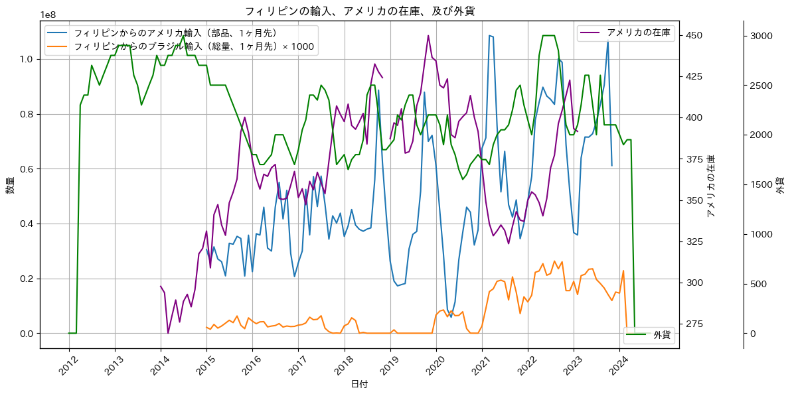
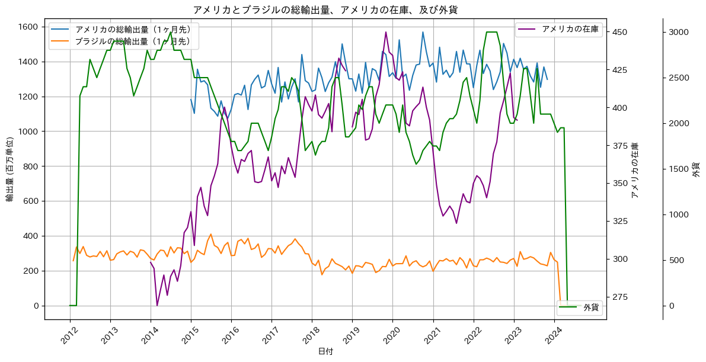

# Cross-Market Export Analysis Visualization

## Overview 
While working as an AI Developer at AVILEN, I was tasked with creating visualizations to analyze US and Brazilian poultry export data. I developed multi-axis visualizations that compared export volumes, inventory levels, and foreign currency rates, providing insights into market dynamics between these major poultry exporters and their key importers.

## Task Context
From the Slack thread, I received a request to create visualizations that would:
1. Plot data from US poultry exports alongside export statistics from Brazil
2. Include visualization of US inventory levels and foreign currency rates
3. Create separate plots for key importing countries: Philippines, China, Angola, Iraq, and South Africa
4. Create an additional plot showing total export volumes from both countries

## Data Sources
The analysis utilized three main datasets:
- `US_POULTLY_EXPORT_QUANTITY.csv` - US poultry export quantities by country
- `ブラジル仕向け先別輸出実績.csv` - Brazilian export data by destination 
- Main dataset containing US inventory levels and currency exchange rates

## Technical Implementation

### Country-Specific Export Analysis
The first visualization examines export patterns for five key markets:
- Philippines
- China
- Angola
- Iraq
- South Africa

The code generates individual plots for each country showing:
- US exports (shifted 1 month forward)
- Brazilian exports (scaled and shifted 1 month forward)
- US inventory levels
- Foreign currency rates

```python
for country in countries:
    fig, ax1 = plt.subplots(figsize=(12, 6))
    
    # Primary axis: Export volumes
    ax1.plot(df.loc[mask, '年月'].shift(-1), df.loc[mask, english_country_name].shift(-1), 
             label=f'{country}からのアメリカ輸入（部品、1ヶ月先）')
    ax1.plot(df.loc[mask, '年月'].shift(-1), df.loc[mask, f'{country}_TOTAL_QTTY'].shift(-1) * scale_factor, 
             label=f'{country}からのブラジル輸入（総量、1ヶ月先）× {scale_factor}')
    
    # Secondary axes: Inventory and currency
    ax2 = ax1.twinx()  # US inventory
    ax3 = ax1.twinx()  # Foreign currency
```

Example visualization for Philippines:


### Total Export Volume Comparison
The second visualization provides a broader perspective comparing:
- Total US exports (in millions)
- Total Brazilian exports (in thousands)
- US inventory levels
- Foreign currency rates

```python
fig, ax1 = plt.subplots(figsize=(12, 6))

# Primary axis: Total export volumes
ax1.plot(df.loc[mask, '年月'].shift(-1), df.loc[mask, 'World Total'].shift(-1) / 1e6, 
         label='アメリカの総輸出量（1ヶ月先）')
ax1.plot(df.loc[mask, '年月'].shift(-1), df.loc[mask, 'total_brazil'].shift(-1) / 1e3, 
         label='ブラジルの総輸出量（1ヶ月先）')
```

 

## Technical Details

### Data Preprocessing
- Time series data aligned using date index
- Data shifted forward one month to show future exports
- Brazilian export volumes scaled by 1000 for better visualization
- US total exports converted to millions
- Filter applied to show data from 2012 onwards

### Visualization Techniques
- Multiple y-axes to show different scales
- Grid lines for better readability
- Yearly x-axis ticks
- Consistent color scheme across plots
- Legend positioning optimized for readability
- Japanese labels for accessibility
