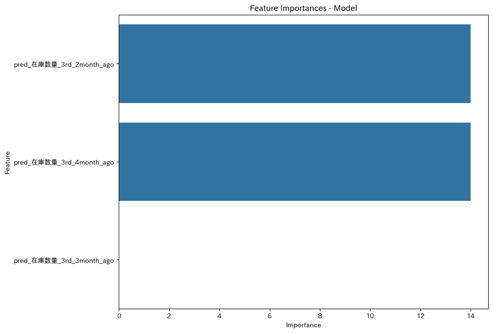
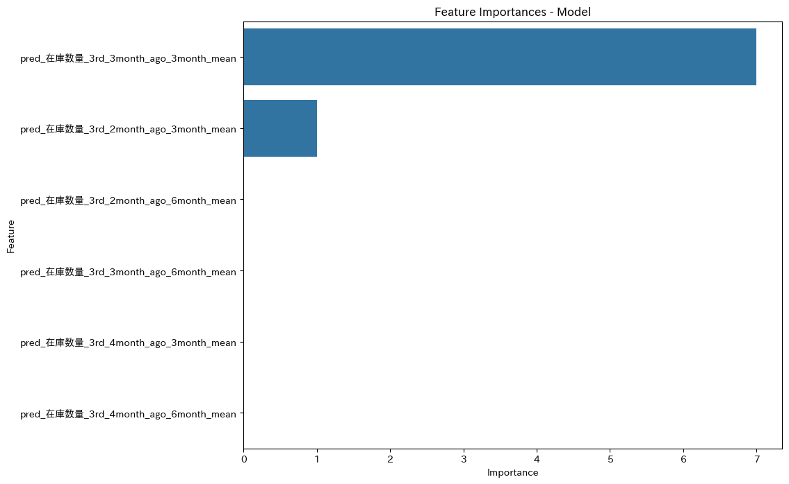
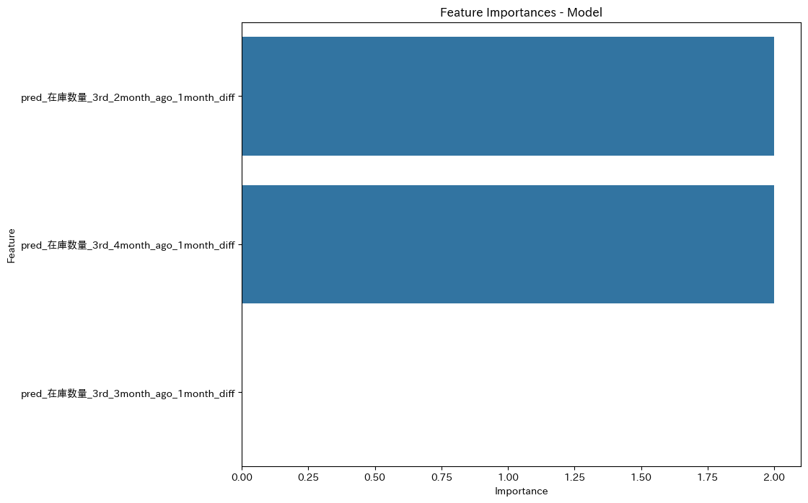
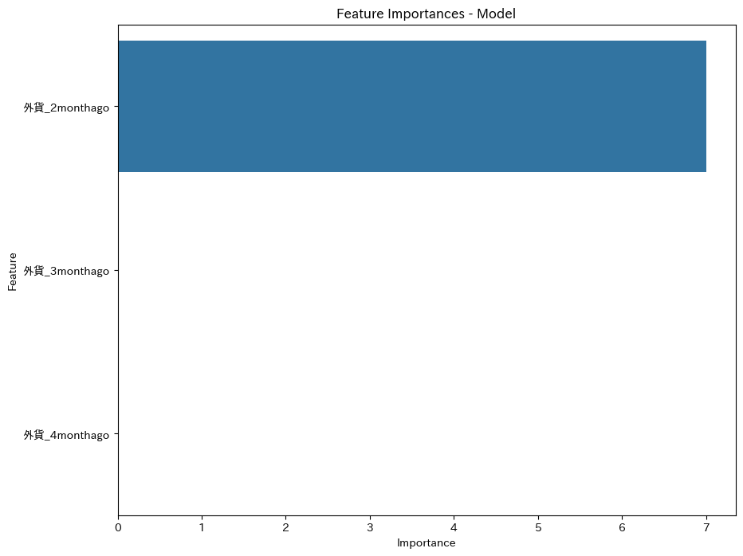
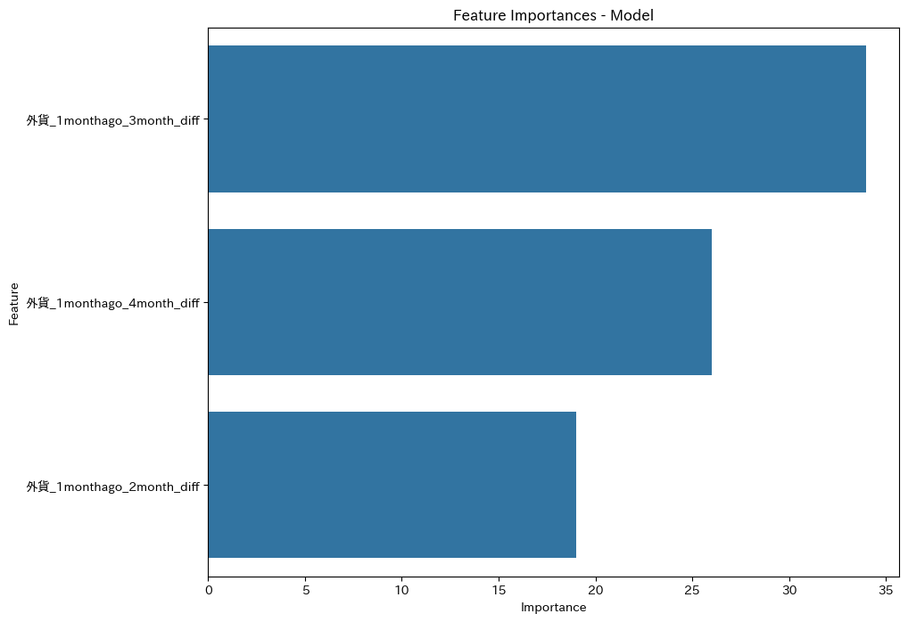
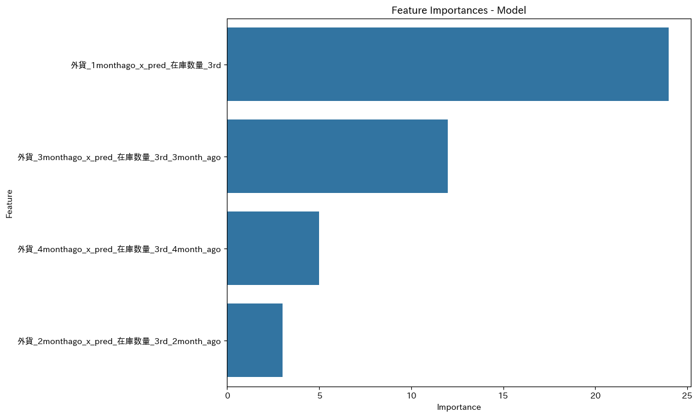
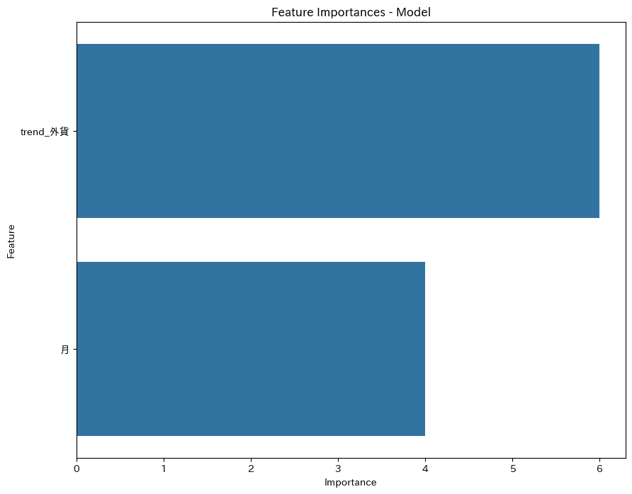
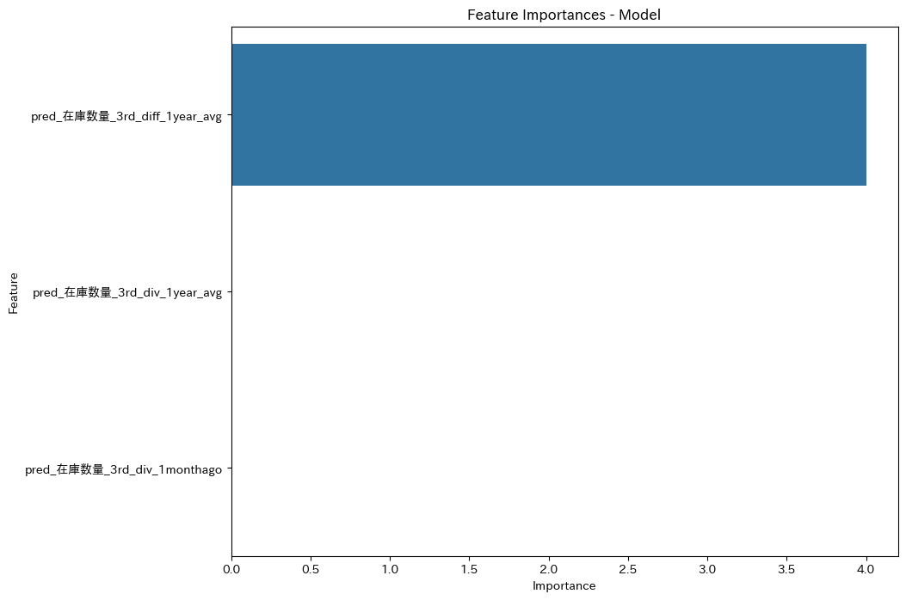
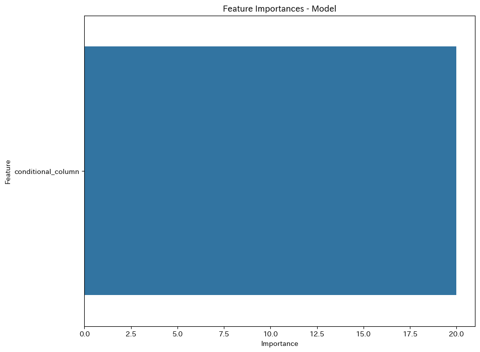
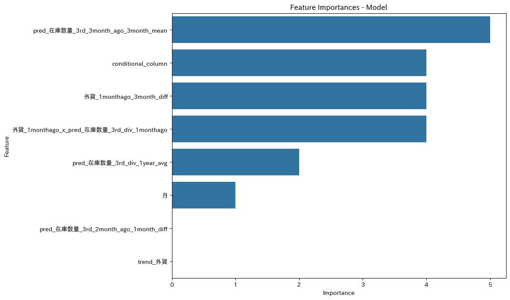

# Predicting Sales Price Adjustments Using LightGBM

## Project Overview
This project focused on developing a machine learning model to predict adjustments to sales prices (販売単価) by analyzing the difference between actual prices and weighted averages. The goal was to achieve a Mean Absolute Percentage Error (MAPE) below 2% on test data starting from January 2021.

## Technical Implementation

### Data Pipeline
The implementation followed a structured approach:

1. **Data Preprocessing**
   - Created lag features for key metrics (2-6 months)
   - Generated rolling statistics (means, standard deviations)
   - Engineered interaction features between currency rates and inventory levels
   - Implemented feature transformations to capture market dynamics

2. **Feature Engineering**
Created systematic variations of core feature sets targeting different aspects of price dynamics:

```python
# Function for creating lag features
def create_lag_features(df, column_name, lags):
    for i in lags:
        df[f'{column_name}_{i}month_ago'] = df[column_name].shift(i)
    return df

# Function for creating rolling statistics
def create_rolling_features(df, column_name, windows):
    for i in windows:
        df[f'{column_name}_{i}month_mean'] = df[column_name].rolling(window=i).mean()
        df[f'{column_name}_{i}month_std'] = df[column_name].rolling(window=i).std()
    return df

# Function for creating month-over-month differences
def create_diff_features(df, column_name, lags):
    for i in lags:
        df[f'{column_name}_{i}month_diff'] = df[column_name].diff(i)
    return df
```

3. **Model Configuration**
```python
params = {
    'num_leaves': 200,
    'objective': 'regression',
    'metric': 'mape',
    'seed': 42,
    'verbose': -1,
    'max_depth': 10,
    'min_data_in_leaf': 5
}
```

### Experimental Feature Sets

I systematically evaluated 10 different feature combinations:

1. **Basic Inventory Lags**
```python
features = [
    'pred_在庫数量_3rd_2month_ago', 
    'pred_在庫数量_3rd_3month_ago', 
    'pred_在庫数量_3rd_4month_ago'
]
# MAPE: 2.15%
```


2. **Rolling Statistics**
```python
features = [
    'pred_在庫数量_3rd_2month_ago_3month_mean',
    'pred_在庫数量_3rd_2month_ago_6month_mean',
    'pred_在庫数量_3rd_3month_ago_3month_mean',
    'pred_在庫数量_3rd_3month_ago_6month_mean',
    'pred_在庫数量_3rd_4month_ago_3month_mean',
    'pred_在庫数量_3rd_4month_ago_6month_mean'
]
# MAPE: 2.13%
```


3. **Inventory Differences**
```python
features = [
    'pred_在庫数量_3rd_2month_ago_1month_diff',
    'pred_在庫数量_3rd_3month_ago_1month_diff',
    'pred_在庫数量_3rd_4month_ago_1month_diff'
]
# MAPE: 2.13%
```


4. **Currency Lags**
```python
features = [
    '外貨_2monthago',
    '外貨_3monthago',
    '外貨_4monthago'
]
# MAPE: 2.14%
```


5. **Currency Differences**
```python
features = [
    '外貨_1monthago_2month_diff',
    '外貨_1monthago_3month_diff',
    '外貨_1monthago_4month_diff'
]
# MAPE: 2.11%
```


6. **Currency-Inventory Interactions**
```python
features = [
    '外貨_1monthago_x_pred_在庫数量_3rd',
    '外貨_2monthago_x_pred_在庫数量_3rd_2month_ago',
    '外貨_3monthago_x_pred_在庫数量_3rd_3month_ago',
    '外貨_4monthago_x_pred_在庫数量_3rd_4month_ago'
]
# MAPE: 2.40%
```


7. **Categorical Features**
```python
features = [
    'trend_外貨',
    '月'
]
# MAPE: 2.13%
```


8. **Derived Inventory Metrics**
```python
features = [
    'pred_在庫数量_3rd_div_1year_avg',
    'pred_在庫数量_3rd_diff_1year_avg',
    'pred_在庫数量_3rd_div_1monthago'
]
# MAPE: 2.15%
```


9. **Conditional Features**
```python
features = [
    'conditional_column'
]
# MAPE: 2.06%
```


10. **Final Combined Model**
```python
features = [
    'conditional_column',
    'pred_在庫数量_3rd_3month_ago_3month_mean',
    'pred_在庫数量_3rd_2month_ago_1month_diff',
    '外貨_1monthago_3month_diff',
    'trend_外貨',
    '月',
    'pred_在庫数量_3rd_div_1year_avg',
    '外貨_1monthago_x_pred_在庫数量_3rd_div_1monthago'
]
# MAPE: 2.04%
```


### Final Model Performance

Detailed prediction results from the final combined model:

```
年月         販売単価_minus_加重平均    予測値      フードへの販売単価   pred_販売単価     MAPE
2021-01-01  -1.783554              3.093109    227.637019      232.513682      2.142298
2021-02-01  -10.754796             3.093109    215.878713      229.726619      6.414669
2021-03-01  -1.071823              3.093109    218.527534      222.692466      1.905907
2021-04-01   1.167627              3.093109    238.906394      240.831876      0.805957
2021-05-01   0.000106              1.142036    252.593303      253.735233      0.452082
...
```

## Technical Stack
- Python 3.x
- LightGBM
- Pandas
- NumPy
- Matplotlib
- Seaborn
- Scikit-learn

## Project Impact
- Successfully predicted sales price adjustments with MAPE close to target threshold of 2%
- Provided systematic evaluation of different feature engineering approaches
- Demonstrated effectiveness of combining multiple feature types for optimal predictions
- Achieved consistent performance across different market conditions
