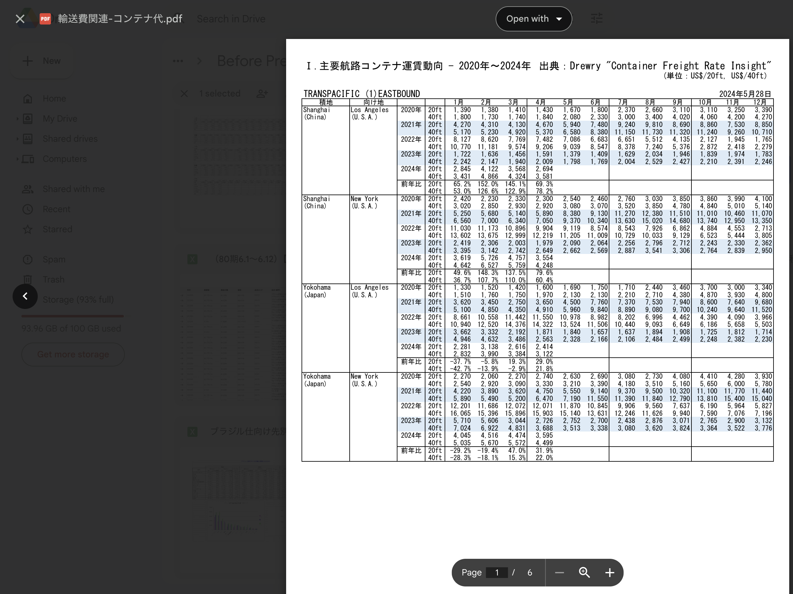
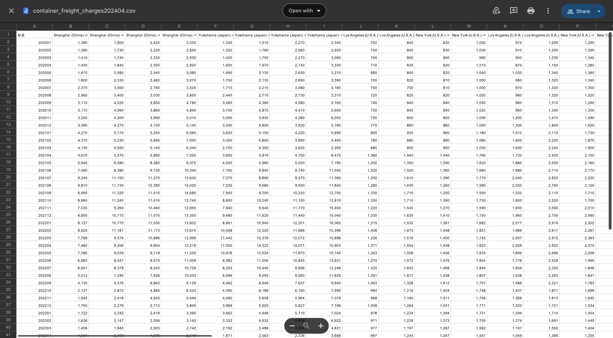
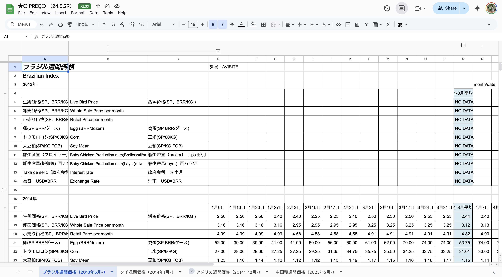
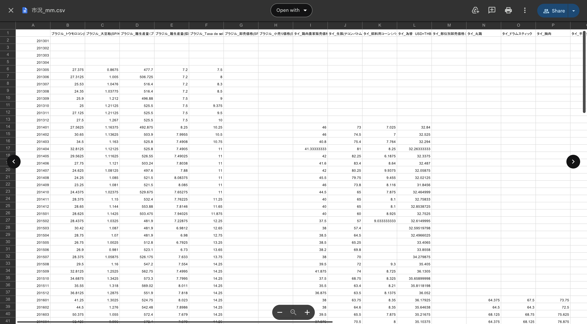
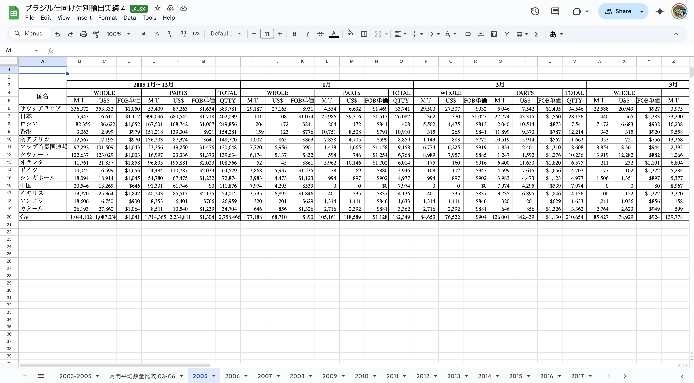
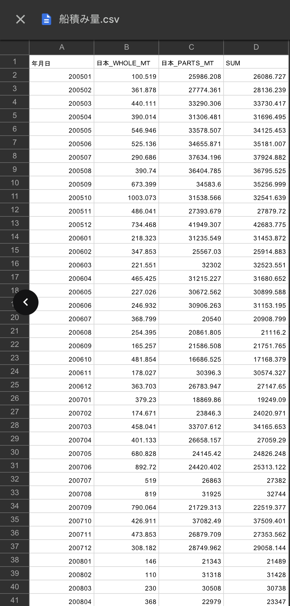

# AVILEN Data Cleaning Projects

## Overview
This repository contains three data cleaning projects completed at AVILEN, demonstrating expertise in transforming complex, unstructured data into clean, analysis-ready formats. Each project handles different data structures and challenges, showcasing versatility in data preprocessing techniques.

## Projects

### 1. Container Freight Charges (`01_container_freight_cleaning.ipynb`)
Processed container freight charge data from PDF format into structured, analyzable data.

#### Input Format

*Original data in PDF format with complex table structures*

#### Output Format

*Cleaned data in structured CSV format*

#### Features:
- **Input**: Complex PDF tables with merged cells and inconsistent formatting
- **Challenges**: 
  - Extraction from PDF format
  - Multiple data sections per page
  - Japanese text handling
- **Output**: Standardized CSV with:
  - Clean date format (yyyymm)
  - Consistent numeric columns
  - Route-based organization
- **Key Techniques**:
  - PDF text extraction
  - Date format standardization
  - Multi-section data merging

### 2. Market Conditions (`02_market_conditions_cleaning.ipynb`)
Consolidated market data from multiple countries into a unified format.

#### Input Format

*Original multi-sheet Excel format with varied structures*

#### Output Format

*Unified market data in standardized format*

#### Features:
- **Input**: Multi-sheet Excel file with data from Brazil, Thailand, USA, and China
- **Challenges**:
  - Multiple data formats per country
  - Currency differences
  - Mixed date formats
  - Special value handling (NA, missing data)
- **Output**: Monthly market condition data with:
  - Standardized currency representations
  - Consistent date formatting
  - Unified missing value handling
- **Key Techniques**:
  - Currency standardization
  - Multi-sheet processing
  - Time series alignment

### 3. Brazil Export Analysis (`03_brazil_export_cleaning.ipynb`)
Transformed Brazilian export data into analyzable time series.

#### Input Format

*Complex Excel structure with nested year data*

#### Output Format

*Clean time series data structure*

#### Features:
- **Input**: Complex Excel structure with nested year data
- **Challenges**:
  - Split year handling
  - Country name translations (English to Japanese)
  - Multiple metric types per country
- **Output**: Clean time series data with:
  - Standardized country names in Japanese
  - Consistent time periods
  - Unified metric organization
- **Key Techniques**:
  - Year splitting and merging
  - Bilingual data handling
  - Time series restructuring

## Key Skills Demonstrated
- PDF data extraction
- Excel file processing
- Japanese text handling
- Date format standardization
- Currency conversion
- Time series alignment
- Missing data handling
- Multi-language data processing

## Tools and Libraries Used
- Python (pandas, numpy)
- Tabula-py (PDF extraction)
- Regular expressions
- Excel file handling
