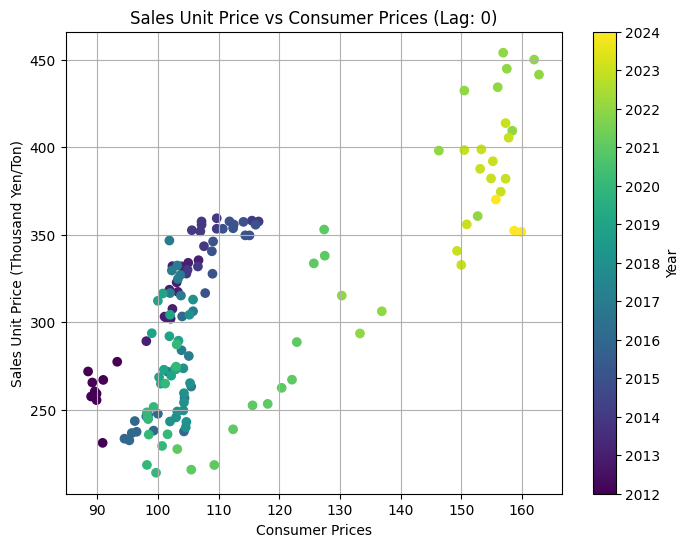
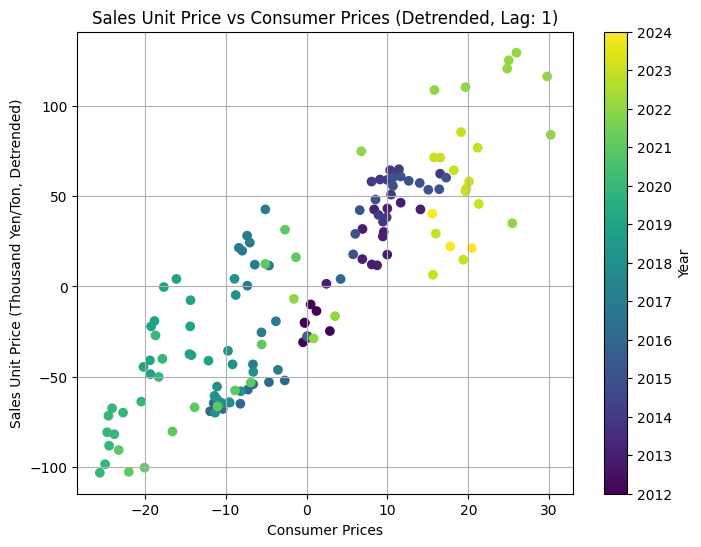
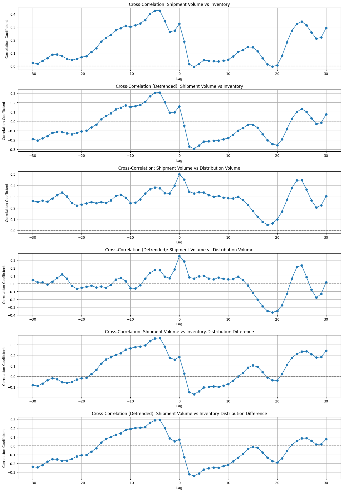

# AVILEN Project: Market Dynamics Analysis

## Project Overview

As part of my work at AVILEN, I developed an analysis of market dynamics focusing on sales unit prices and shipping volumes. The project involved time series analysis using cross-correlation techniques to understand relationships between various market indicators.

## Business Context

The analysis aimed to understand:
- Relationships between sales unit prices and market indicators (inventory, consumer prices, exchange rates)
- Correlations between shipping volumes and inventory/distribution metrics
- Lag effects in market relationships
- Underlying patterns independent of long-term trends

## Technical Implementation

### Data Sources

The analysis integrated four key datasets:
- Sales unit prices (フードへの販売単価)
- Inventory levels (pred_在庫数量_3rd)
- Consumer price index (類別/_飲食料品・食料用農水産物)
- Exchange rates (USDJPY)

### Methodology

#### 1. Data Preprocessing
- Aligned time series data using date indexing
- Applied 3-month rolling averages for smoothing
- Handled missing values using appropriate filling techniques
- Standardized date formats across datasets

#### 2. Cross-Correlation Analysis
- Calculated cross-correlations with lags from -30 to +30 months
- Applied scipy.signal.detrend to remove linear trends
- Generated correlation plots for both raw and detrended data

#### 3. Visualization
- Created multi-panel plots showing correlations at different lags
- Generated scatter plots colored by year for highest correlations
- Implemented separate visualizations for raw and detrended data

### Implementation Highlights

```python
def cross_corr(data1, data2, lag=30):
    return [data1.corr(data2.shift(l)) for l in range(-lag, lag+1)]

# Calculate rolling means
df['rolling_mean'] = df['value'].rolling(window=3).mean()

# Detrend data
detrended = pd.Series(signal.detrend(df['value']))
```

## Key Findings

### Sales Unit Price vs Consumer Prices Analysis

#### Raw Data Analysis (Lag 0)

*Analysis of direct relationship between sales unit prices and consumer prices*

The raw data visualization revealed:
1. Period Distribution:
   - Early Period (2012-2016): Clustered around consumer prices 90-110, sales prices 250-360K yen/ton
   - Recent Period (2022-2024): Shifted to consumer prices 150-160, sales prices reaching 450K yen/ton
2. Clear positive correlation throughout the entire period (2012-2024)
3. Strong upward trend over time, indicating inflation in both metrics
4. Year-based clustering visible through color progression (purple to yellow)

#### Detrended Analysis (Lag 1)

*Analysis of relationship after removing long-term trends, with 1-period lag*

The detrended analysis showed:
1. Maintained positive correlation even after trend removal
2. Temporal Patterns:
   - Earlier years (2012-2017): Predominantly negative detrended values
   - Recent years (2022-2024): Higher volatility with both positive and negative deviations
3. Lag-1 relationship suggests consumer price changes may be a leading indicator
4. Increased volatility in recent period (2022-2024)

Key Insights:
1. Strong underlying inflation trend visible in raw data
2. Robust relationship persists even after detrending
3. Recent years (2022-2024) show both higher price levels and increased volatility
4. Consumer prices appear to lead sales unit price changes
5. Relationship dynamics have evolved, showing more variability in recent years

### Shipping Volume Analysis

*6-panel visualization showing cross-correlations between shipping volumes and inventory metrics (inventory levels, distribution volumes, inventory-distribution differences), both raw and detrended*

The 3-month rolling average analysis demonstrated:
1. Strong relationships between shipping volumes and inventory levels
2. Complex lag structures in distribution volume correlations
3. Notable differences between raw and detrended correlations

## Technical Stack

- **Data Processing**: pandas, numpy
- **Analysis**: scipy (signal processing, detrending)
- **Visualization**: matplotlib
- **Development Environment**: Google Colab

## Project Impact

This analysis provided valuable insights into market dynamics, helping stakeholders understand:
- The relationship between sales prices and various market indicators
- Time lag effects in market relationships
- The impact of long-term trends on market dynamics

## Skills Demonstrated

- Time series analysis
- Advanced data preprocessing
- Statistical analysis (cross-correlation)
- Data visualization
- Python programming
- Business insight development
