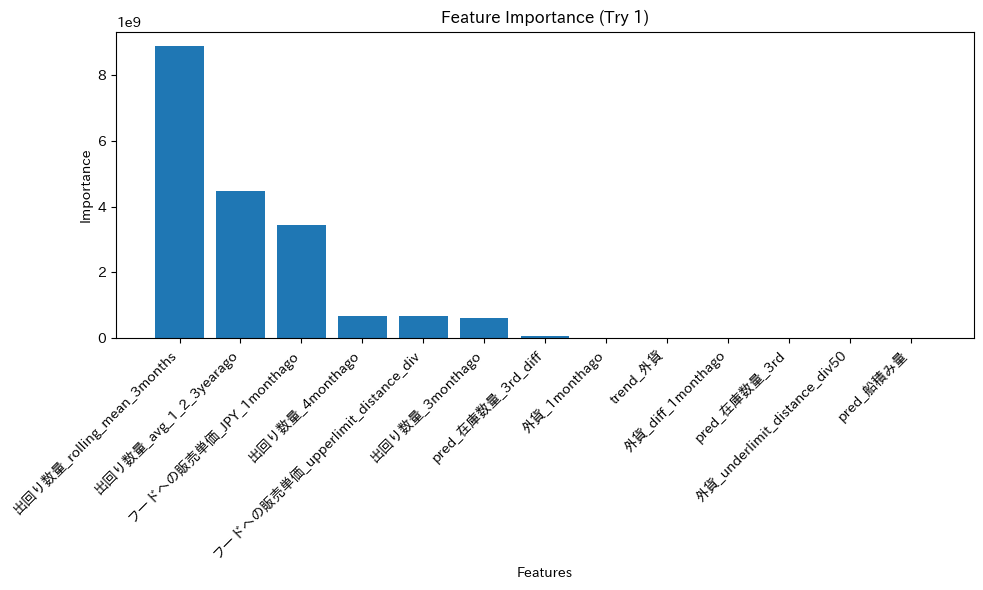

# AVILEN Time Series Analysis Project: Predicting Distribution Volume

## Project Overview 

This project focused on predicting distribution volume (出回り数量) by evaluating different feature combinations using LightGBM. The core task was to engineer new features, particularly looking at the average of same months over past years, and assess their impact on prediction accuracy.

## Data and Model Configuration

### Data Structure
- Training period: 2016 onwards
- Test period: 2021 onwards
- Target variable: 出回り数量 (Distribution Volume)

### Model Parameters
Consistent LightGBM configuration across all experiments:
```python
params = {
    'objective': 'regression',
    'metric': 'mape',
    'boosting_type': 'gbdt',
    'num_leaves': 31,
    'learning_rate': 0.05,
    'feature_fraction': 0.9
}

additional_settings = {
    'num_boost_round': 10000,
    'early_stopping_rounds': 5000
}
```

## Feature Engineering

The following features were engineered and evaluated:

1. Historical Lag Variables
   - 3-month lag (出回り数量_3monthago)
   - 4-month lag (出回り数量_4monthago)

2. Rolling Statistics
   - 3-month rolling mean (出回り数量_rolling_mean_3months)
   - Historical yearly averages (出回り数量_avg_1_2_3yearago)
   
3. Market Indicators
   - Foreign currency features (外貨_1monthago, trend_外貨)
   - Sales price indicators (フードへの販売単価_JPY_1monthago)
   - Inventory predictions (pred_在庫数量_3rd)

## Experimental Results

### Try 1: Initial Feature Set
Used all available features including newly engineered ones
- MAPE: 0.0644 (6.44%)
- Feature importance analysis revealed significant impact of rolling means



### Try 2: Selected Features
Features used:
- 出回り数量_4monthago
- 外貨_diff_1monthago
- pred_在庫数量_3rd_diff
- 出回り数量_rolling_mean_3months
MAPE: 0.0637 (6.37%)

### Try 3: Alternative Feature Selection
Features used:
- 出回り数量_rolling_mean_3months
- 出回り数量_avg_1_2_3yearago
- フードへの販売単価_JPY_1monthago
- 出回り数量_4monthago
- フードへの販売単価_upperlimit_distance_div
MAPE: 0.0722 (7.22%)

### Try 4: Refined Combination
Features used:
- 出回り数量_3monthago
- 出回り数量_4monthago
- フードへの販売単価_JPY_1monthago
- pred_船積み量
- 出回り数量_avg_1_2_3yearago
MAPE: 0.0603 (6.03%)

### Try 5: Minimal Feature Set
Features used:
- 出回り数量_rolling_mean_3months
- 出回り数量_avg_1_2_3yearago
MAPE: 0.0601 (6.01%)

## Key Technical Implementation

### Feature Engineering Implementation
```python
# Rolling mean calculation
data['出回り数量_rolling_mean_3months'] = data['出回り数量'].rolling(window=3).mean()

# Historical yearly average calculation
data['出回り数量_avg_1_2_3yearago'] = (
    df['出回り数量'].shift(12) + 
    df['出回り数量'].shift(24) + 
    df['出回り数量'].shift(36)
) / 3
```

### Model Training Process
```python
# Train/validation split
X_train_part, X_val, y_train_part, y_val = train_test_split(
    X_train, y_train, test_size=0.3, random_state=42
)

# Dataset creation
lgb_train = lgb.Dataset(X_train_part, y_train_part)
lgb_val = lgb.Dataset(X_val, y_val, reference=lgb_train)

# Model training
model = lgb.train(
    best_params,
    train_set=lgb_train,
    valid_sets=[lgb_train, lgb_val],
    valid_names=['train', 'eval'],
    num_boost_round=num_boost_round,
    callbacks=[
        lgb.early_stopping(stopping_rounds=5000, verbose=True),
        lgb.log_evaluation(100),
        lgb.record_evaluation(evals_result)
    ]
)
```

## Results Summary

1. Best Performance
   - Achieved with minimal feature set (Try 5)
   - MAPE: 6.01%
   - Features used: rolling mean and historical yearly averages

2. Feature Effectiveness
   - Historical averages proved highly predictive
   - Rolling means provided significant predictive power
   - Complex feature combinations did not outperform simpler sets

## Technical Stack
- Python 3.x
- LightGBM 
- pandas
- scikit-learn
- matplotlib
